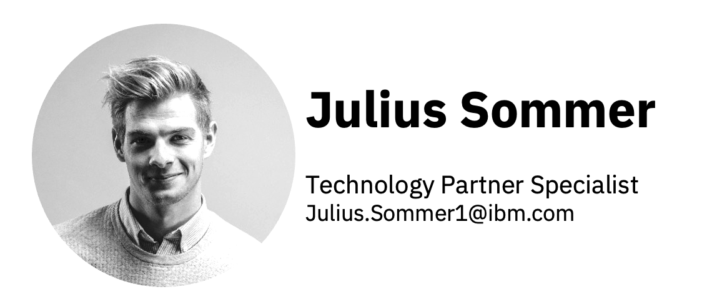
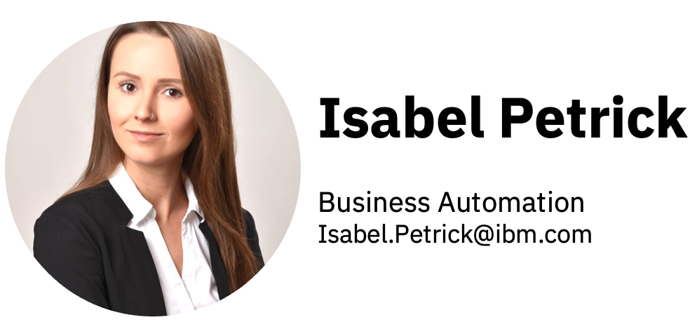
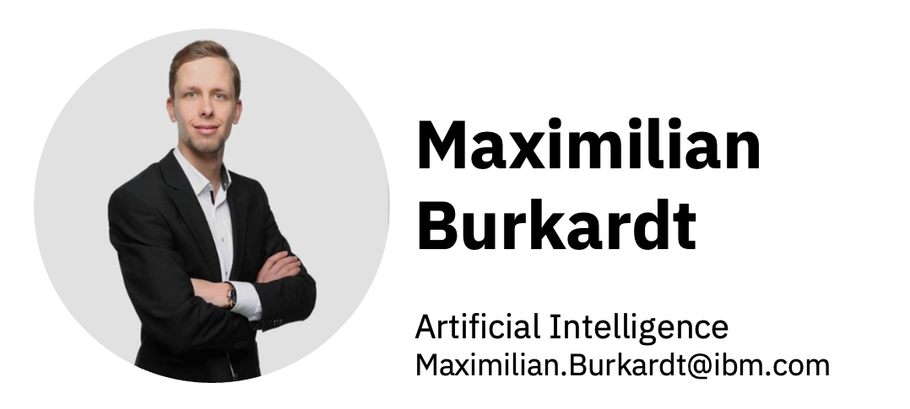

# Das IBM Team

Wenn Sie in den Bereichen der künstlichen Intelligenz, Data Architektur oder Business Automation aktiv sind, freuen wir uns sehr darüber, Ihre Ansprechpatner als IBM Team zu sein.  

## Wer sind wir?

Mit dieser kurzen Video möchten wir uns kurz vorstellen und Sie über die Technologien informieren, mit der wir zusammen arbeiten können.

### **Ihrer zentraler Ansprechpartner**

[{ style="height:50%;width:50%;" align=left }](mailto:julius.sommer@ibm.com)
 Ich bin Ihren Kontakt für alle Ihre Anliegen und, gemeinsam mit meinem technischen Team, kümmere mich um den Erfolg von Ihren Projekten. Bitte zögern Sie nicht, mich zu kontaktieren und ich freue mich auf die Zusammenarbeit

### **Information Architecture**

[{ style="height:50%;width:50%;" align=right }](mailto:angelito@deibm.com)

Dieser Bereich fasst die Datenhaltung, Datenflüßen, Data Governance und auch noch zusätliche Werkzeuge um.  Und vieles mehr, was ich hier nicht sagen kann, weil es zu lang wäre und habe keinen Platz

### **Business Automation**

[{ style="height:50%;width:50%;" align=left }](mailto:angelito@deibm.com)

Business Automation ist das Beste, was es gibt. Alle wollen das haben und keiner kann ohne Business Automation überleben, die Produkte sind absolut genial und alles kostet kaum Geld. Bitte bestellen Sie sofort und Sie werden immer zufrieden sein

### **Artificial Intelligence**

[{ style="height:50%;width:50%;" align=right }](mailto:maximilian.burkardt@deibm.com)
Artificial Intelligence ist nicht nur cool, sondern mega-geil und alle Menschen wollen AI in ihren Geräten, in ihren Business Prozessen und überall, wo es funktionieren kann. Nicht vergessen das klassische Business Analytics, weil das nach wie vor auch verrwendet wird

<!-- | [Business Automation](BA.md) | [Information Architecture](IA.md) | [Artificial Intelligence](AI.md) | -->
<!-- | :-------------------------:  | :-------------------------------: | :------------------------------: | -->
<!-- |  [Isabel Petrick](BA.md) |  [Angel González](IA.md) |  [Maximilian Burkhard](AI.md) | -->